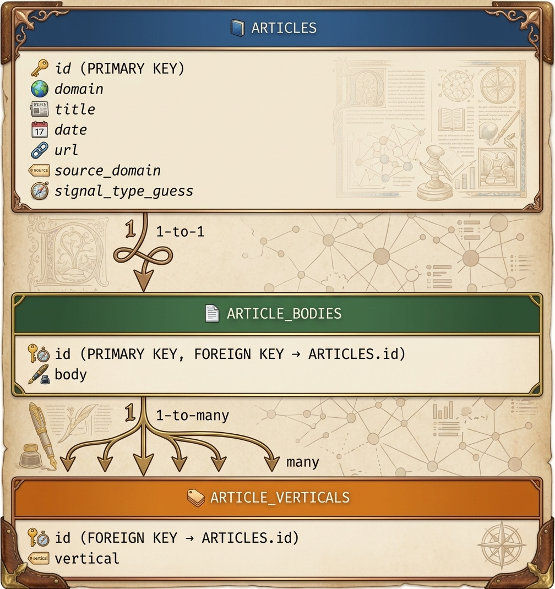

# Orange Opportunity Spaces (HuMaSoo)

A lightweight pipeline that collects domain signals (news & partner pages), extracts recurring themes with an LLM-guided workflow, generates actionable "opportunity spaces" (industry × use case × technology), scores them, and stores results in a local SQLite radar database. Intended for technology foresight analysts and innovation teams who want reproducible, auditable opportunity discovery across multiple domains.

[Deployed Streamlit App](https://orange-innovation-radar.streamlit.app/)  


## Highlights
- Collects domain signals (news, PRs) and partner content.
- Two-step LLM workflow: theme extraction → opportunity-space generation (with structured prompts).
- Scoring engine to prioritize opportunities based on weighted criteria.
- Persists raw signals and scored opportunity spaces to a local SQLite DB (`./data/opportunity_spaces.db`).
- Designed for multi-domain runs and resumable execution.

### Stack
- Language(s): Python (primary), CSS (small frontend portions)
- Runtime: Python 3.10+ (recommended)
- Notable libraries: streamlit, httpx, eventregistry, pandas, pydantic, codecarbon, ecologits, google-genai (via provider)


## Repo layout (top-level)
```
orange_opportunity_spaces_HuMaSoo/
│
├── .gitignore                                    # Git ignore patterns (Python cache, venv, .env, IDE configs)
├── README.md                                     # Project guide: setup, architecture, CLI usage
├── requirements.txt                              # Python dependencies (Streamlit, Pydantic, Google GenAI, CodeCarbon, etc.)
├── main.py                                       # Main pipeline orchestrator (domain → themes → opportunities → scoring)
├── latest_innovation_radar_presentation.odp     # Stakeholder presentation deck
│
├── data/                                         # Persistent data storage
│   ├── opportunity_spaces.db                     # SQLite database (articles, opportunities, scores, pipeline state)
│   ├── codecarbon_gen_ai_prompt.csv              # CO₂ emissions log from LLM inference runs
│   └── codecarbon_newapi_domain_signals.csv      # Emissions tracking for domain signal collection
│
└── src/                                          # Source code
    │
    ├── ERD.jpeg                                  # Database schema visualization (DrawDB)
    ├── config.py                                 # Central config: domains, keywords, model lists, API setup
    ├── newsapi_to_db.py                          # Fetches domain news from Event Registry; inserts into DB
    ├── partners_scraper.py                       # Scrapes Orange partner pages; populates partners table
    ├── prompts.py                                # LLM system prompts (Step1/Step2 extraction, TED classification)
    │
    ├── backend/                                  # Core pipeline logic
    │   │
    │   ├── build_database.py                     # Initializes SQLite schema with all required tables
    │   ├── db_operations.py                      # Database I/O: fetch articles, save opportunities, manage domain status
    │   ├── first_extraction.py                   # Step 1: LLM-driven theme extraction from articles
    │   ├── first_extraction_safety.py            # Sanitizes themes, resolves hallucinated IDs, fuzzy matching fallback
    │   ├── json_repair_utilities.py              # Fixes malformed LLM JSON; normalizes Step1/Step2 outputs
    │   ├── pydantic_schemas.py                   # Pydantic validators for type-safe parsing of LLM responses
    │   ├── opportunity_spaces.py                 # Step 2: LLM-driven opportunity space generation from themes
    │   ├── safe_api_calls.py                     # Resilient LLM wrapper (multi-model fallback, key rotation, retries)
    │   ├── scores.py                             # Step 3: Scores opportunities (signal strength, diversity, weighted rank)
    │   ├── scanner_ted.py                        # Fetches EU procurement notices (TED API) → transforms to signal format
    │   └── ted_to_db.py                          # Classifies TED notices into domains; inserts into articles table
    │
    └── frontend/                                 # Streamlit UI application
        │
        ├── app.py                                # Streamlit entry point: routing & view management
        ├── components.py                         # Reusable Streamlit components (hero, cards, empty states, sidebar)
        ├── data_loader.py                        # SQLite queries; builds opportunity objects for UI rendering
        ├── front_config.py                       # Frontend config (DB path, CSS path, domain labels, GitHub URL)
        ├── frontend.md                           # Frontend documentation (views, data flow, components)
        │
        ├── assets/                               # Static assets
        │   ├── alt_styles.css                    # Custom Streamlit styling
        │   └── humasoo_logo.png                  # Logo for sidebar navigation
        │
        └── views/                                # Streamlit page components
            ├── dashboard.py                      # Dashboard: filterable grid of all opportunities
            └── opportunity.py                    # Detail view: full opportunity breakdown with scoring
```

How it fits together
- Data collection: `src/newsapi_to_db.py` fetches recent articles/signals (Event Registry / NewsAPI) and inserts normalized rows into the SQLite DB. `src/partners_scraper.py` scrapes partner pages and writes partner entries to the DB.
- Pipeline runner: `main.py` orchestrates the pipeline per-domain. It:
  1. Fetches raw articles from the DB
  2. Calls the Step 1 extractor (themes) via `src.backend.first_extraction`
  3. Runs sanitization/safety filters `src.backend.first_extraction_safety`
  4. Calls Step 2 opportunity generator `src.backend.opportunity_spaces` (uses prompts in `src/prompts.py`)
  5. Scores outputs with `src.backend.scores` and stores results via `src.backend.db_operations`
- Prompts & LLMs: `src/prompts.py` contains the STEP1/STEP2 system prompts used to constrain LLM outputs to strict JSON schemas so the pipeline can parse them reliably.

## Quickstart — run locally

1. Clone and create a virtual environment
```bash
git clone https://github.com/husseinabuammar24-cloud/orange_opportunity_spaces_HuMaSoo.git
cd orange_opportunity_spaces_HuMaSoo
python -m venv .venv
source .venv/bin/activate
```

2. Install dependencies
```bash
pip install -r requirements.txt
```

3. Environment variables
Create a `.env` file at the project root containing API keys and any required credentials. At minimum:
- NEWSAPI_AI_KEY — API key for the Event Registry / NewsAPI integration used by `src/newsapi_to_db.py`
- GEMINI_API_KEY_1 / GEMINI_API_KEY_2 / GEMINI_API_KEY_3 — the pipeline uses a GenAI provider. Optimization allows rotation between API Keys.
> [!CAUTION]
> Keep your API Keys in a local file.

4. Initialize / inspect database
- The pipeline writes to `./data/opportunity_spaces.db` by default. You can inspect the ERD at `src/ERD.jpeg`.

5. Populate the DB with signals (optional)
- To fetch signals for all configured domains (reads `DOMAIN_KEYWORD_MAP` in `src/config.py`), run:
```bash
python src/newsapi_to_db.py
```
This will insert normalized articles into the DB. Ensure `NEWSAPI_AI_KEY` is set in `.env`.

6. Run the main pipeline
```bash
python main.py            # runs all domains found in src.config.DOMAIN_KEY_MAP
# Example: run a subset of domains and force reprocessing
python main.py --domains sustainability,cloud --force
# To change DB path:
python main.py --db-path ./data/opportunity_spaces.db
```
- Flags:
  - `--domains` : comma-separated subset of domains to process
  - `--force` : re-run domains even if already marked "success" in DB
  - `--db-path` : path to the SQLite DB

7. Run partner scraper (optional)
```bash
python src/partners_scraper.py
```
This will scrape configured partner pages and insert partners into the DB.


## Data & DB
- Default DB path: `./data/opportunity_spaces.db`
- Tables include: articles, article_bodies, article_verticals, partners, opportunity_spaces (scored results), and status tracking per domain.
- See `src/ERD.jpeg` for schema visualization, created by [DrawDB](https://www.drawdb.app/)




## Prompting & Models
- Prompt templates live in `src/prompts.py`. STEP1 extracts top themes and returns a strict JSON schema; STEP2 generates opportunity spaces and a scoring breakdown.
- Models used are defined in `src/config.py` (MODELS_STEP1, MODELS_STEP2). Adjust models/providers through `src/config.py` and your environment/credentials.

## Notes & Operational considerations
- The pipeline uses LLM providers and third-party APIs — watch API usage and quotas.
- The code includes basic emissions tracking (codecarbon) and uses Ecologits for provider telemetry.
- The project assumes English (`lang="eng"`) signals by default; adjust `newsapi_to_db.py` if needed.
- The prompt system enforces strict JSON outputs — if a model returns non-JSON output the pipeline may fail to parse results.

## Contributing
- Add issues or PRs for bug fixes, improved prompts, or additional domains.
- To add a domain, update `src/config.py`'s `DOMAIN_KEYWORD_MAP` with keywords and ensure scraping/collection rules are appropriate.

## Timeline
- 2 weeks (17/08/2025 - 28/08/2028)

## Contributors 
- [Hussein Abuammar](https://www.linkedin.com/in/hussein-abuammar/)
- [Max Huberland](https://www.linkedin.com/in/max-h-540881409/)
- [Sooyoung Lee](https://www.linkedin.com/in/sooyoung-lee-patoobyte/)
